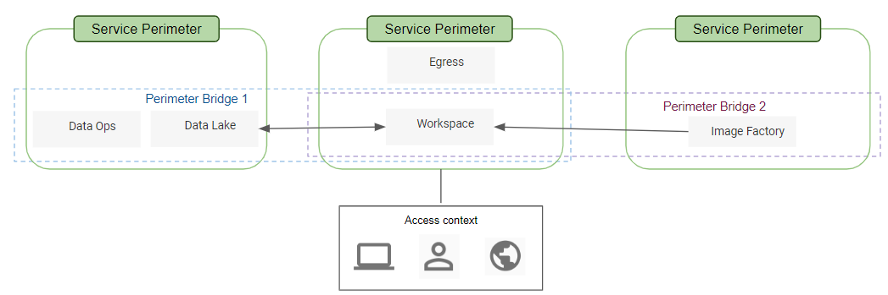

# VPC Service Controls and Bridges

## Reference Architecture



This module handles the creation of VPC Service Controls and Access Context Management configuration and deployments for researcher workspaces and egress projects.

The resources that this module will create are:

* One access context manager that adds researchers, if they are added to the variable `researchers`
* One service perimeter that includes the workspace and egress project
* A bridge between the workspace project and the data ops and data lake project
* A bridge between the workspace project adn the image factory project


## Prerequisites

* The projects in the foundation (`data-ops`, `data-lake`, `data-ingress`, `image-factory`) with a VPC service perimeter must already be established, if not, this module will fail.
* For intial deployment of a new researcher workspace, the variable [`num_instances`](../env/template/workspace/terraform.tfvars) must be set to `0` initially because the perimeter and bridge must be established before an instance can read images provided by `image-factory`.

### Known limitations

The [Access Context Manager API](https://cloud.google.com/access-context-manager/docs/) guarantees that resources will be created, but there may be a delay between a successful response and the change taking effect. For example, ["after you create a service perimeter, it may take up to 30 minutes for the changes to propagate and take effect"](https://cloud.google.com/vpc-service-controls/docs/create-service-perimeters).
Because of these limitations in the API, you may first get an error when running `terraform apply` for the first time.

### Notes

- To remove an access level, first remove the binding between perimeter and the access level without removing the access level itself. Once you have run `terraform apply`, you'll then be able to remove the access level and run `terraform apply` again.

**Example**

In this example, the variable `external_users_vpc` has users populated and the access level has been created. Now we want to remove all users from `external_users_vpc` value, but before we do so, we MUST remove the access level bind set in the perimeter as described in the example below. Run a `terraform apply` after the change.
```diff
- access_levels = local.access_levels
+ access_levels = [local.fdn_sa]
```

Lastly, set the `external_users_vpc` variable back to an empty string. Run a `terraform apply` after the change.
```diff
- external_users_vpc = ["user:foo@bar.com"]
+ external_users_vpc = []
```


<!-- TFDOC OPTS files:1 show_extra:1 -->
<!-- BEGIN TFDOC -->

## Files

| name | description | modules |
|---|---|---|
| [access_level.tf](./access_level.tf) | None | <code>access_level</code> |
| [backend.tf](./backend.tf) | None |  |
| [bridge_service_perimeter.tf](./bridge_service_perimeter.tf) | None | <code>bridge_service_perimeter</code> |
| [data.tf](./data.tf) | None | <code>constants</code> |
| [outputs.tf](./outputs.tf) | Module outputs. |  |
| [regular_service_perimeter.tf](./regular_service_perimeter.tf) | None | <code>regular_service_perimeter</code> |
| [variables.tf](./variables.tf) | Module variables. |  |

## Variables

| name | description | type | required | default | producer |
|---|---|:---:|:---:|:---:|:---:|
| [external_users_vpc](variables.tf#L7) | List of individual external user ids to be added to the VPC Service Control Perimeter to allow access to bucket in Egress project. Each account must be prefixed as `user:foo@bar.com`. Groups are not allowed to a VPC SC. | <code>list&#40;string&#41;</code> |  | <code>&#91;&#93;</code> |  |
| [researcher_workspace_name](variables.tf#L1) | Variable represents the GCP folder to place resource into and is used to separate tfstate. GCP Folder MUST pre-exist. | <code>string</code> |  | <code>&#34;workspace-1&#34;</code> |  |

<!-- END TFDOC -->
