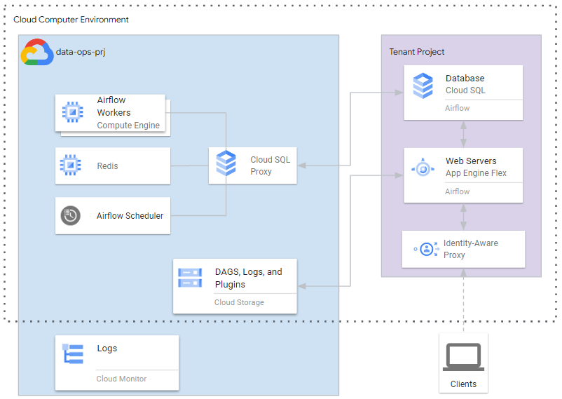

# Directory to Provision a Cloud Composer Environment

The purpose of this directory is to provision a Cloud Composer environment that is fully managed by GCP. Cloud Composer is a resource that allows for data orchestration workflows to be used. Primarily this will be used to take data from the staging project and move it to a researcher's workspace GCS ingress bucket.

This directory does not need to be updated when new research groups are onboarded into the SRDE. The purpose of this directory is to only maintain the Cloud Composer instance.

## Optional tfvar Fields to Configure

1. In the `terraform.tfvars` file in the [env](./env/) directory there are some optional fields that can be configured to customize the deployment of the Cloud Composer instance.

<!-- TFDOC OPTS files:1 show_extra:1 -->
<!-- BEGIN TFDOC -->

## Files

| name | description | modules | resources |
|---|---|---|---|
| [backend.tf](./backend.tf) | None |  |  |
| [composer_dag.tf](./composer_dag.tf) | None |  | <code>google_storage_bucket_object</code> · <code>local_file</code> |
| [main.tf](./main.tf) | Module-level locals and resources. | <code>cloud_composer</code> · <code>constants</code> |  |
| [org-pol.tf](./org-pol.tf) | None |  | <code>google_project_organization_policy</code> · <code>time_sleep</code> |
| [outputs.tf](./outputs.tf) | Module outputs. |  |  |
| [variables.tf](./variables.tf) | Module variables. |  |  |

## Variables

| name | description | type | required | default | producer |
|---|---|:---:|:---:|:---:|:---:|
| [allowed_ip_range](variables.tf#L13) | The IP ranges which are allowed to access the Apache Airflow Web Server UI. | <code title="list&#40;object&#40;&#123;&#10;  value       &#61; string&#10;  description &#61; string&#10;&#125;&#41;&#41;">list&#40;object&#40;&#123;&#8230;&#125;&#41;&#41;</code> |  | <code>&#91;&#93;</code> |  |
| [cloud_sql_ipv4_cidr](variables.tf#L22) | The CIDR block from which IP range in tenant project will be reserved for Cloud SQL. | <code>string</code> |  | <code>&#34;10.4.0.0&#47;24&#34;</code> |  |
| [database_machine_type](variables.tf#L28) | The machine type to setup for the SQL database in the Cloud Composer environment. | <code>string</code> |  | <code>&#34;db-n1-standard-4&#34;</code> |  |
| [disk_size](variables.tf#L34) | The disk size in GB for nodes. | <code>string</code> |  | <code>&#34;50&#34;</code> |  |
| [enforce](variables.tf#L88) | Whether this policy is enforced. | <code>bool</code> |  | <code>true</code> |  |
| [env_variables](variables.tf#L40) | Variables of the airflow environment. | <code>map&#40;string&#41;</code> |  | <code>&#123;&#125;</code> |  |
| [gke_machine_type](variables.tf#L52) | Machine type of Cloud Composer nodes. | <code>string</code> |  | <code>&#34;n1-standard-2&#34;</code> |  |
| [image_version](variables.tf#L46) | The version of Airflow running in the Cloud Composer environment. Latest version found [here](https://cloud.google.com/composer/docs/concepts/versioning/composer-versions). | <code>string</code> |  | <code>&#34;composer-1.20.2-airflow-1.10.15&#34;</code> |  |
| [master_ipv4_cidr](variables.tf#L58) | The CIDR block from which IP range in tenant project will be reserved for the master. | <code>string</code> |  | <code>null</code> |  |
| [node_count](variables.tf#L64) | Number of worker nodes in the Cloud Composer Environment. | <code>number</code> |  | <code>3</code> |  |
| [oauth_scopes](variables.tf#L70) | Google API scopes to be made available on all node. | <code>set&#40;string&#41;</code> |  | <code>&#91;&#34;https:&#47;&#47;www.googleapis.com&#47;auth&#47;cloud-platform&#34;&#93;</code> |  |
| [srde_project_vms_allowed_external_ip](variables.tf#L5) | This list constraint defines the set of Compute Engine VM instances that are allowed to use external IP addresses, every element of the list must be identified by the VM instance name, in the form: projects/PROJECT_ID/zones/ZONE/instances/INSTANCE | <code>list&#40;string&#41;</code> |  | <code>&#91;&#93;</code> |  |
| [web_server_ipv4_cidr](variables.tf#L76) | The CIDR block from which IP range in tenant project will be reserved for the web server. | <code>string</code> |  | <code>&#34;10.3.0.0&#47;29&#34;</code> |  |
| [web_server_machine_type](variables.tf#L82) | The machine type to setup for the Apache Airflow Web Server UI. | <code>string</code> |  | <code>&#34;composer-n1-webserver-4&#34;</code> |  |

## Outputs

| name | description | sensitive | consumers |
|---|---|:---:|---|
| [airflow_uri](outputs.tf#L5) | URI of the Apache Airflow Web UI hosted within the Cloud Composer Environment. |  |  |
| [composer_env_id](outputs.tf#L15) | ID of Cloud Composer Environment. |  |  |
| [composer_env_name](outputs.tf#L10) | Name of the Cloud Composer Environment. |  |  |
| [dag_bucket_name](outputs.tf#L30) | Google cloud storage bucket name only without suffix |  |  |
| [gcs_bucket](outputs.tf#L25) | Google Cloud Storage bucket which hosts DAGs for the Cloud Composer Environment. |  |  |
| [gke_cluster](outputs.tf#L20) | Google Kubernetes Engine cluster used to run the Cloud Composer Environment. |  |  |

<!-- END TFDOC -->
