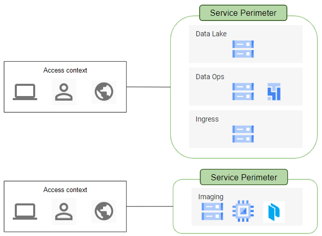

# VPC Service Controls and Bridges

This repository provides an opinionated way to deploy VPC Service Perimeters and Access Context Managers. 

## Reference Architecture

This module handles the creation of VPC Service Controls and Access Context Management configuration and deployments for all the foundation projects: `data-lake`, `data-ops`, `ingress`, and `image-factory`.

The resources that this module will create are:

* Three different access context managers:
    1. `{env}_cloudbuild`: A <b>required</b> resource to build a list of service accounts that need access to the different projects to move data around (cloud composer sa), read data from data lake (notebook-sa) or to read configurations (prisma-sa).
    1. `{env}_admins`: An <i>optional</i> resource to add IT admins to the list of foundation project.
    1. `{env}_stewards`: A <b>required</b> resource to add users to upload data to the GCS buckets in the `ingress` project. Add users to the constants [vpc_sc_users ](../constants/constants.tf#L29) variable.
* Two service perimeters
    1. That includes `data-lake`, `data-ops`, and `ingress` projects.
    1. That includes the `image` project.

### Known limitations

The [Access Context Manager API](https://cloud.google.com/access-context-manager/docs/) guarantees that resources will be created, but there may be a delay between a successful response and the change taking effect. For example, ["after you create a service perimeter, it may take up to 30 minutes for the changes to propagate and take effect"](https://cloud.google.com/vpc-service-controls/docs/create-service-perimeters).
Because of these limitations in the API, you may first get an error when running `terraform apply` for the first time.

### Notes

- To remove an access level, first remove the binding between perimeter and the access level without removing the access level itself. Once you have run `terraform apply`, you'll then be able to remove the access level and run `terraform apply` again.

<!-- TFDOC OPTS files:1 show_extra:1 -->
<!-- BEGIN TFDOC -->

## Files

| name | description | modules | resources |
|---|---|---|---|
| [access_level.tf](./access_level.tf) | None | <code>access_level</code> |  |
| [backend.tf](./backend.tf) | None |  |  |
| [data.tf](./data.tf) | None | <code>constants</code> |  |
| [outputs.tf](./outputs.tf) | Module outputs. |  |  |
| [regular_service_perimeter.tf](./regular_service_perimeter.tf) | None | <code>regular_service_perimeter</code> | <code>null_resource</code> |
| [variables.tf](./variables.tf) | Module variables. |  |  |

## Variables

| name | description | type | required | default | producer |
|---|---|:---:|:---:|:---:|:---:|
| [parent_access_policy_id](variables.tf#L1) | The AccessPolicy this AccessLevel lives in. One per org and must exist prior to running terraform. | <code>number</code> | ✓ |  |  |
| [ip_subnetworks_admins](variables.tf#L6) | Condition - A list of CIDR block IP subnetwork specification. May be IPv4 or IPv6. Note that for a CIDR IP address block, the specified IP address portion must be properly truncated (i.e. all the host bits must be zero) or the input is considered malformed. For example, \"192.0.2.0/24\" is accepted but \"192.0.2.1/24\" is not. Similarly, for IPv6, \"2001:db8::/32\" is accepted whereas \"2001:db8::1/32\" is not. The originating IP of a request must be in one of the listed subnets in order for this Condition to be true. If empty, all IP addresses are allowed. | <code>list&#40;string&#41;</code> |  | <code>&#91;&#93;</code> |  |
| [ip_subnetworks_stewards](variables.tf#L12) | Condition - A list of CIDR block IP subnetwork specification. May be IPv4 or IPv6. Note that for a CIDR IP address block, the specified IP address portion must be properly truncated (i.e. all the host bits must be zero) or the input is considered malformed. For example, \"192.0.2.0/24\" is accepted but \"192.0.2.1/24\" is not. Similarly, for IPv6, \"2001:db8::/32\" is accepted whereas \"2001:db8::1/32\" is not. The originating IP of a request must be in one of the listed subnets in order for this Condition to be true. If empty, all IP addresses are allowed. | <code>list&#40;string&#41;</code> |  | <code>&#91;&#93;</code> |  |

## Outputs

| name | description | sensitive | consumers |
|---|---|:---:|---|
| [foundation_perimeter_name](outputs.tf#L13) | The perimeter's name. |  | <code>egress,</code> · <code>workspaces</code> |
| [foundation_resources](outputs.tf#L19) | A list of GCP resources that are inside of the service perimeter. Currently only projects are allowed. |  | <code>egress,</code> · <code>workspaces</code> |
| [foundation_shared_resources](outputs.tf#L25) | A map of lists of resources to share in a Bridge perimeter module. Each list should contain all or a subset of the perimeters resources |  | <code>egress,</code> · <code>workspaces</code> |
| [parent_access_policy_id](outputs.tf#L1) | Access Policy ID |  | <code>egress,</code> · <code>workspaces</code> |
| [serviceaccount_access_level_name](outputs.tf#L7) | Description of the Service account AccessLevel and its use. Does not affect behavior. |  | <code>egress,</code> · <code>workspaces</code> |

<!-- END TFDOC -->

