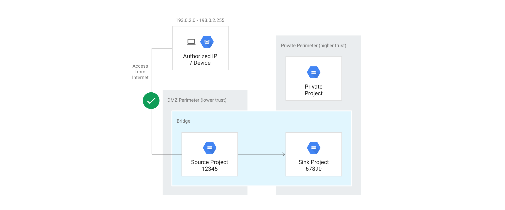

# Terraform Module for Provisioning a VPC Service Control Bridge Perimeter

The purpose of this directory is to provision a VPC Service Control bridge perimeter. A bridge perimeter can be thought of as a bi-directional tunnel between two independent VPC SC regular perimeters. A bridge perimeter can be used to allow a restricted service, such as `storage.googleapis.com`, to be accessed for a `gsutil cp` command from a GCS bucket in `Project A` to a GCS bucket in `Project B`. If this bridge perimeter was not present and `storage.googleapis.com` was a restricted service then a `gsutil` command could not be used to move data from `Project A` to `Project B`.

Additional information of VPC Service Control bridge perimeters can be found [here](https://cloud.google.com/vpc-service-controls/docs/share-across-perimeters#service_perimeter_bridges).



## Usage

Below is an example of how to use this module.

`gcloud organizations list` is used to gather the Organization ID
`gcloud access-context-manager policies list --organization=<ORG_ID>` is used to gather the `parent_policy_name` field

```terraform
module "bridge_service_perimeter" {
  source = "./modules/vpc_service_controls/bridge_service_perimeter"

  // REQUIRED

  bridge_service_perimeter_name      = "my_bridge_perimeter_name"
  parent_policy_name                 = "0123456789"
  bridge_service_perimeter_resources = "0123456789" // PROJECT NUMBER

  // OPTIONAL

  bridge_service_perimeter_description = "My bridge perimeter description."
}
```

## Modules

| Name | Source | Version |
|------|--------|---------|
| bridge_service_perimeter | terraform-google-modules/vpc-service-controls/google//modules/bridge_service_perimeter |  |

## Inputs

| Name | Description | Type | Default | Required |
|------|-------------|------|---------|:--------:|
| bridge\_service\_perimeter\_description | Description of the bridge perimeter | `string` | `""` | no |
| bridge\_service\_perimeter\_name | Name of the bridge perimeter. Should be one unified string. Must only be letters, numbers and underscores | `string` | `""` | no |
| bridge\_service\_perimeter\_resources | A list of GCP resources that are inside of the service perimeter. Currently only projects are allowed. | `list(string)` | `[]` | no |
| parent\_policy\_name | Name of the parent policy. | `string` | `""` | no |

## Outputs

| Name | Description |
|------|-------------|
| bridge\_service\_perimeter\_resources | A list of GCP resources that are inside of the service perimeter. Currently only projects are allowed. |