# How to deploy Secure Data Environment
There are a number of build steps to deploy a Secure Data Environment. The steps need to be followed in order to have a successfull build deployment.

## Table Contents
1. [Automation Project](##-Automation-Project)
2. [Pipeline Bootstrap](##-Pipeline-Bootstrap)
3. [Build Packer Project](##-Build-Packer-Project)
4. [Foundation Access Levels and VPC Service Controls](##-Foundation-Access-Levels-for-VPC-Service-Controls)
5. [Staging Project](##-Build-the-Staging-Project)
6. [Update Folder Policies to Apply Constraints](##Update-Folder-Policies-to-Apply-Constraints)
7. [Build the Data Lake Project](##-Build-the-Data-Lake-Project)
8. [Build the Researcher Projects](##-Build-the-Researcher-Projects)
9. [PathML & Docker Setup](##-PathML-&-Docker-Setup)


---

## Automation Project
An "Automation" project with Cloud Build need to exist. If one has not been created, then create a new project with Cloud Build API enabled. Ensure the follow APIs have been enabled.
- [ ] Enable APIs:
	- [ ] `cloudbuild.googleapis.com`
	- [ ] `Cloud Resource Manager API`
	- [ ] `Cloud Billing API`
	- [ ] `Cloud Billing Budget API`
	- [ ] `Identity and Access Management API`
	- [ ] `Access Context Manager API`
	- [ ] `Cloud OS Login API`

Please confirm the following IAM permissions have been granted to the Cloud Build service account:
- [ ] Grant the Cloud build SA - `Access context manager admin`, `Organization Policy Admin` at the org level.
- [ ] Grant the Cloud Build SA `Folder IAM Admin`, `Project Creator` at the `Sensitive` folder level.
- [ ] Grant the Cloud Build SA `Billing User` on the billing id.
- [ ] Create a storage bucket **& prefix** for Terraform state.

---

## Pipeline Bootstrap

A pipeline bootstrap trigger does not exist and we'll need to create one. From Cloud Build: First, we'll connect to a source repository like GitHub, GCP Source Code Repo, or BitBucket, manually create a trigger, and then update the `constants.tf` file.

<u>Steps</u>

1. Connect to a source code repository.
	1. Open up the [Triggers](https://console.cloud.google.com/cloud-build/triggers) page in the Google Cloud Console.
	2.  Follow this [guide](https://cloud.google.com/build/docs/automating-builds/build-repos-from-github) for assistance to connect to GitHub.
2.  Create a trigger and call it `pipeline-bootstrap-apply`. We'll need to create a trigger and point to a cloudbuild file and create three substitution variables.
			1. cloudbuild file location: `cloudbuild/deployments/cloudbuild-iam-and-pipelines-apply.yaml`
			2. Substition variables:
				- _BUCKET = `bucket`
				- _PREFIX = `prefix`
				- _TAG = `0.13.5`
	>Note: The below example is to create a trigger that's connected to GCP Source Repo.
	```bash
	gcloud alpha builds triggers create pipeline-bootstrap-apply \
	--name="srde-cloudbuild-iam-pipelines-apply" \
	--repo="<repo-name>" \
	--branch-pattern="^master$" \
	--included-files="environment/deployments/wcm-srde/cloudbuild-iam-and-pipelines/terraform.tfvars" \
	--build-config="cloudbuild/deployments/cloudbuild-iam-and-pipelines-apply.yaml" \
	--substitutions _BUCKET=<BUCKET>,_PREFIX=<PREFIX>,_TAG=0.13.5
	```

3. Update the  [cloudbuild-iam-and-pipeline terraform.tfvars](./environment/deployments/wcm-srde/cloudbuild-iam-and-pipelines/terraform.tfvars) with new values.
	1. **DO NOT GIT PUSH, YET**
4. Update the [constants folder](environment/deployemtns/wcm-srde/constants/constants.tf).
	1. Update any value with a comment of `// CHANGE BEFORE FIRST DEPLOYMENT`
		a. Example: `org_id`, `billing_account_id`, etc.
5. Git commit and git push.
6. The manual pipeline created in earlier steps will trigger the pipeline and create all of our triggers in Cloud Build.
	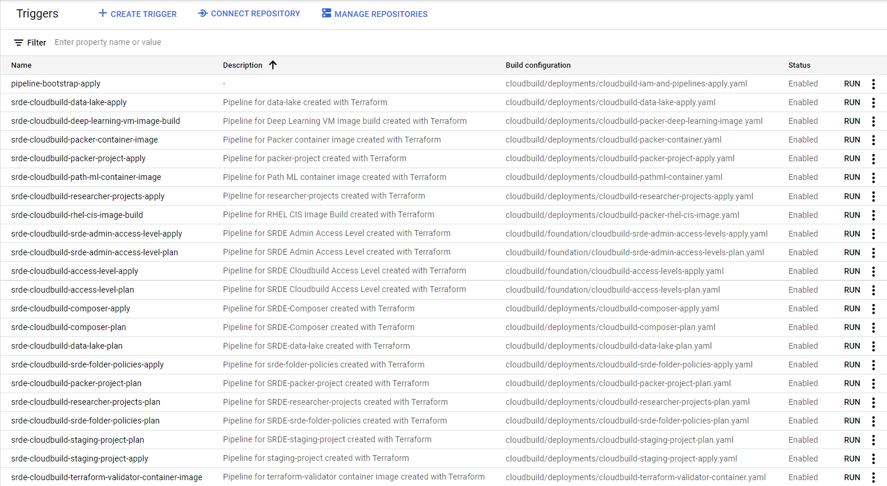

---

## Build Packer Project

Here, we'll create a packer project. This project's main purpose is to be like an instance factory. It will create containers and instances which will then provide GCE instances and containers to other projects.
	
### Step 1 - Create a Packer Project
The default VPC will be deployed in `us-central1` region. If additional regions need to be added, other files like container pipelines and folder policies **MUST** be updated to include these additional regions.

<u>Steps</u>
1. Environment > deployments > wcm-srde > Packer-project.
	1. Look for any comments with `// CHANGE BEFORE FIRST DEPLOYMENT` in the `terraform.tfvars` and update accordingly.
		- `project_name` = "srde-packer"
		- `deploymentmanager_editor` = "group:packer-admin@example.com"
2. Git commit and git push.
3. A pipeline will trigger off this change and deploy the project.
4. Capture the Packer `project_id` used for next steps.
5. Confirm the Artifact Repositories exist.
```bash
gcloud artifacts repositories list

# output

REPOSITORY: packer
...

REPOSITORY: path-ml
...

terraform-validator
...
```
	
### Step 2 - Update Constants.tf and the Pipeline Triggers with Packer Project ID

Now that the packer project is created, we need to update some terraform files so it can be used in different places throughout the build.

<u>Steps</u>

1. **After** the packer project is build, update Environment > Deployments > wcm-srde > the `constants.tf`
	```diff
	- packer_project_id = ""
	+ pakcer_project_id = "packer-srde-123"
	```
	2. **Do NOT GIT PUSH**.
1. Some of the triggers require the packer project id so we need to update all the triggers. Instead of going into each one individually, we can update all of them by editing the `terraform.tfvars` in the [cloudbuild-iam-and-pipelines](./environment/deployments/wcm-srde/cloudbuild-iam-and-pipelines) directory with the packer `project_id` from the previous steps.
	1. Environment > deployments > wcm-srde > cloudbuild-iam-and-pipelines > terraform.tfvars.
	```diff
	- srde_packer_project_id = ""
	+ srde_packer_project_id = "packer-srde-123"
	```

1. Git commit and push changes.
1. The `pipeline-bootstrap-apply` trigger will pick up the changes and update all the triggers with the packer project id.


### Step 3 - Build containers

The Packer Project uses multiple containers for different pipelines. We need to build these containers and host them in the GCP Artifact Registry in the Packer Project.

Below are the steps to create three containers

| Container Name | Purpose |
| ----------------  | ---------|
| [Packer](####-Build-the-Packer-Container) | HashiCorp Packer container to build instances. |
| [Terraform Validator](####-Build-the-Terraform-Validator-Container) | Terraform Validator tests terraform manifests. |
| [PathML](####-Build-the-PathML-Container) | A custom container languages and tools for PathML. |

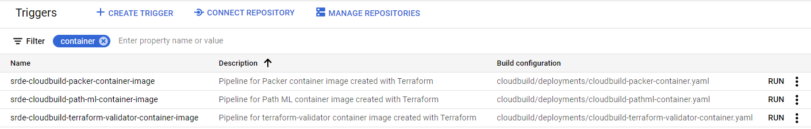

#### Build the Packer Container
1. Build the Packer container.
	1. Manually run the pipeline `[srde-cloudbuild-packer-container-image]` in cloud build.

#### Build the Terraform Validator Container
1. Build the Terraform Validator container.
	1. Manually run the pipeline `[srde-cloudbuild-terraform-validator-container-image]` in cloud build.

#### Build the PathML Container
1. Build the PathML container.
	1. Manually run the pipeline `[srde-cloudbuild-path-ml-container-image]` in cloud build.


### Step 4 - Images Build
The Packer Project builds instances. Below are the steps to create instances.

| VM Instance Name | Purpose |
| ------------------- | --------- |
| [Bastion Host](####-Build-the-Bastion-instance) | Hardended instance whose purpose is to provide access to a private network from an external network like the Internet. |
| [Deep Learning Instance](####-Build-the-Deep-Learning-instance) | Hardened instance with Deep learning language and libraries. |
| ~~[PathML Instance](####-Build-the-PathML-instance) | Instance used to host the PathML and Jupyter notebook. |

#### Build CIS REHL 8 Level 2 Image

1. From the Packer Project, go tot he GCP Marketplace and create an instance base off the  `CIS Red Hat Ente-rprise Linux 8 benchmark - level 2`. 

2. Name of the instance doesn't matter. Main purpose to get  an image as the source image.
	1. Change the location to the default subnet of `us-central1-b`.
    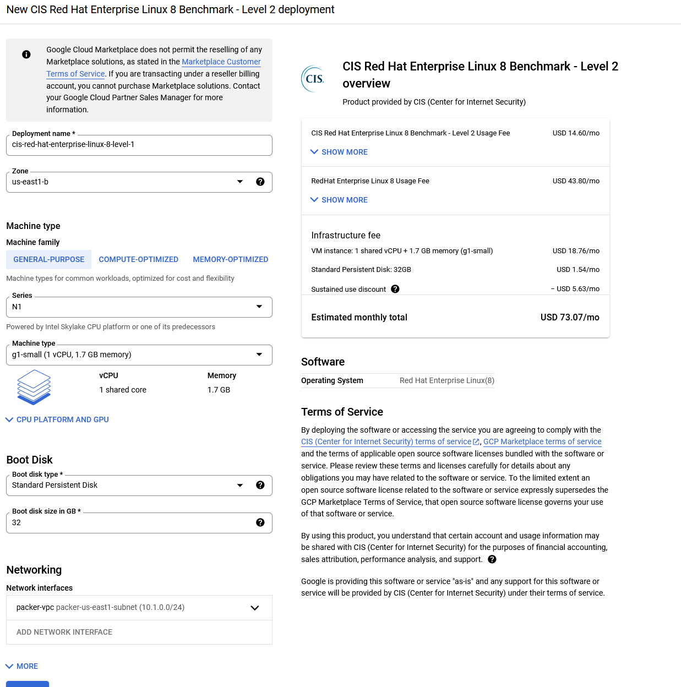

3. Click deploy.

	Got an error message:

    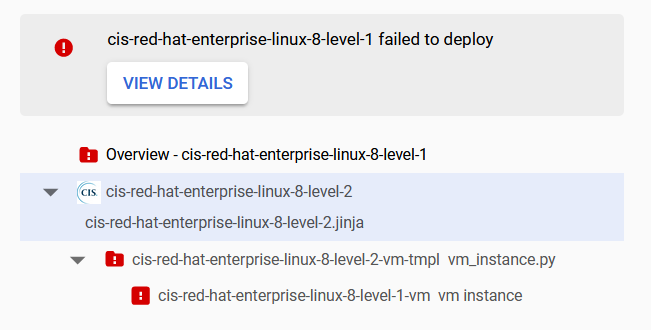
	- Work around was to disable the Shielded VM, Externa lP VM, and Trusted Image Project Org policies at the folder level.

4. Create a RHEL-CIS image based off the newly created instance.
	1. Go to Compute Engine > Turn off the instance.
	```bash
	gcloud compute instances stop $(gcloud compute instances list --format="value(NAME)") --zone=us-central1-b
	```
	
5. Create the image.
	```bash
	gcloud compute images create rhel-cis-image \
		--source-disk=$(gcloud compute disks list --format="value(NAME)" \
		--zones=us-central1-b) \
		--source-disk-zone=us-central1-b
	```

    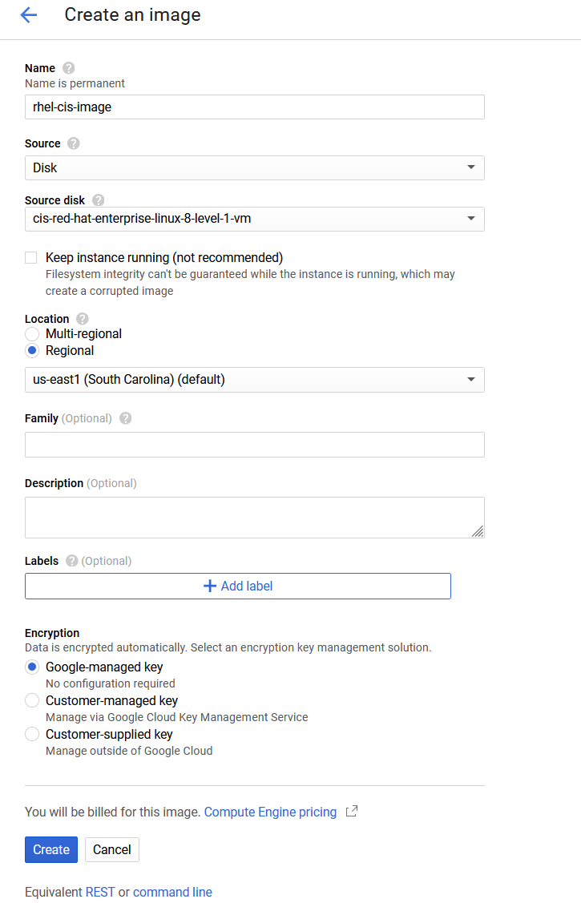


3. Delete the instance `CIS Red Hat Enterprise Linux 8 benchmark - level 2`. This will also delete the original disk.

	```bash
	gcloud compute instances delete $(gcloud compute instances list --format="value(NAME)") --zone=us-central1-b --quiet
	```

#### Build the Bastion instance
1. Create an image based off RHEL image using Packer.
	1. Update > environment > deployments > wcm-srde > packer-project-researcher-vm-image-build > edit `packer-rhel-cis-image.json`. Make sure the source image name equals what's in Google.
		`source_image = "rhel-cis-image"`
        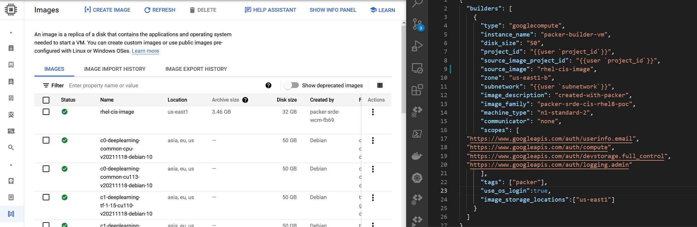
		1. Make any necessary changes and commit changes.
1. Manually run the `srde-cloudbuild-rhel-cis-image-build` trigger.
	1. A temporary instance is created in the Packer project and then captured into an image. This process takes some time.
	1. When Packer is complete, you'll have a new instance image located under the **Images** section in GCE.
1. Packer creates images with an appended random digit. Grab that digit now to be passed in as variable later.
	```bash
	# From Packer Project
	gcloud compute images list --filter="packer-srde-cis-rhel8-poc" --format="value(NAME)"
	```
1. Update the [`Constants.tf`](../../environment/deployments/wcm-srde/constants/constants.tf) with the new packer-id for the bastion host.
	```diff
	- packer_base_image_id_bastion = ""
	+ packer_base_image_id_bastion = "packer-1638936420"
	```


#### Build the Deep Learning instance
1. Create an image based off of Google's Deep Learning image.
1. Manually run the `srde-cloudbuild-deep-learning-vm-image-build` trigger.
	1. A temporary instance is created in the Packer project and then captured into an image. This process takes some time.
	1. When Packer is complete, you'll have a new instance image located under the **Images** section in GCE.
1. Packer creates images with an appended random digit. Grab that digit now to be passed in as variable later.
	```bash
	# From Packer Project
	gcloud compute images list --filter="deep-learning-packer-image" --format="value(NAME)"
	```
1. Update the `Constants.tf` with the new packer-id for the bastion host.
	```diff
	- packer_base_image_id_deeplearning = ""
	+ packer_base_image_id_deeplearning = "packer-163893677"
1. Git commit and git push.


---


## Foundation Access Levels for VPC Service Controls

At the organization level, we're going to add [Access Levels](https://console.cloud.google.com/security/access-leve) and [VPC Service Controls](https://console.cloud.google.com/security/service-perimeter?) to put a service perimiter around certain projects and provide who has access into those projects.
	
We're going to use [Access Context](https://cloud.google.com/access-context-manager/docs/overview) to help define the fine-grained access to control access to projects and resources. Access Context has three categories to help define our access. The steps below will be based on User Identity.

<u>Steps</u>

1. Update Environment > deployment > wcm-srde > constants > `constants.tf`
```diff
- cloudbuild_access_level_name = ""
+ cloudbuild_access_level_name = "cloud_build_service_account"
- srde_admin_access_level_name = ""
+ srde_admin_access_level_name = "<function>_group_member"
```
1. Update Environment > Foundation > vpc-service-controls > srde-admin-access-levels > `terraform.tfvars`
	1. Update the `access_level_members` with the desired user accounts. TODAY: Only service accounts and users are allowed.
1. Git commit and git push.
1. The pipeline `srde-cloudbuild-srde-admin-access-level-apply` will get triggered, if not, run it manually.
1. The pipeline `srde-cloudbuild-access-level-apply` will need to be ran automatically.

---

## Build the Staging Project

1. Deploy the environment > deployments > wcm-srde > `staging-project`.
	1. Update the `terraform.tfvars` with appropriate values.
1. Pipeline `srde-cloudbuild-staging-project-apply` may pick up, if not manually run.
1. **After** the staging project is build, get the project id and update the `constants.tf` file with the new staging project id.
	1. Update envrionment > deployments >wcm-srde > constants > `constants.tf`
		```diff
		- # staging_project_id = ""
		+ staging_project_id = "wcm-srde-staging-project-8cb2"
		```
1. Git commit and git push.


### Build Cloud Composer
1. Update Environment > deployments > wcm-srde > staging-project > cloud-composer > `terraform.tfvars`
	1. The `terraform.tfvars` file may be empty, which is fine. Make a minor change to trigger the `srde-cloudbuild-composer-apply` pipeline.
	1. Git commit and push.
	1. Takes about 25 minutes to build.
	>ERROR: If the build doesn't complete and you get a similar error below, that means the `constants.tf` did not get updated.
	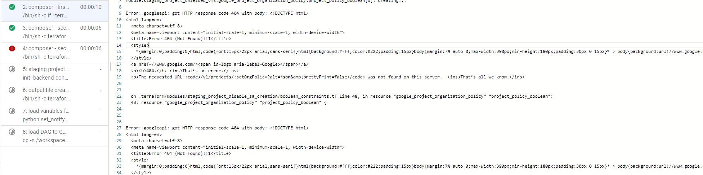
1. You will get get an error at the end of the build. This is because we don't have the GCS Bucket created before the build.
	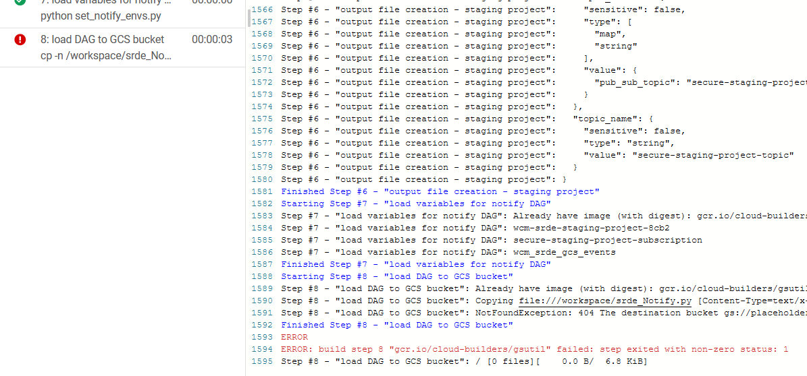
1. Get the bucket name value from the GCP console in the Staging Project. The `gcs_bucket` name will be printed in the output of the CI pipeline.
	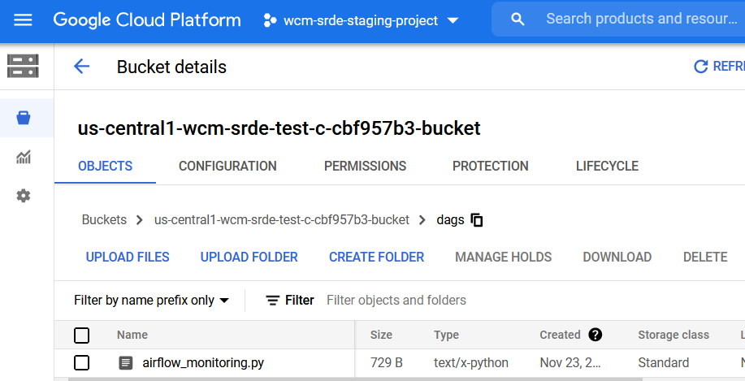
	
	```bash
	gsutil ls
	# output
	gs://us-central1-wcm-srde-test-c-1235654-bucket
	```
	>Note: You may need to give yourself elevated permissions to see the bucket. `roles/Storage.Viewer` should be fine.
1. Update the constants file with the new composer access level. Update Environment > deployments > wcm-srde > constants > `constants.tfvars`
	```diff
	- cloud_composer_access_level_name = ""
	+ cloud_composer_access_level_name = "composer_service_account"
	```
	1. Git commit and push.
	1. No pipeline will trigger.
1. Update Environment > deployments > wcm-srde > cloudbuild-iam-and-pipelines > `terraform.tfvars`
	```diff
	- srde_composer_dag_bucket = ""
	+ srde_composer_dag_bucket = "us-central1-composer-all-pr-a94cfde9-bucket"
	```
	1. Git commit and push.
	1. Pipeline `pipeline-bootstrap-apply` will launch and update any triggers with the new DAG bucket.
	>Example: After the `pipeline-bootstrap-apply` is complete any trigger, like `srde-cloudbuild-composer-apply` will have a value for the SUBSTITUTION VARIABLE for `_COMPOSER_DAG_BUCKET`.
	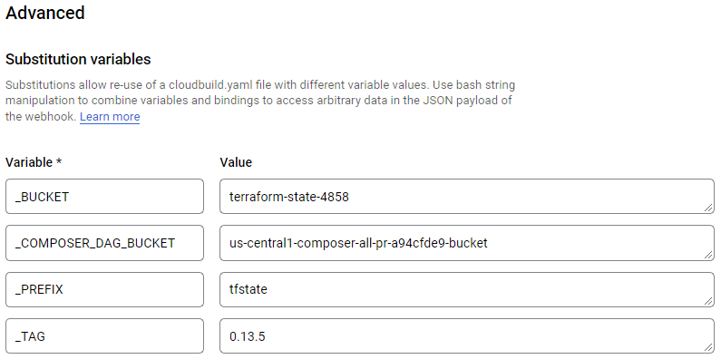
1. Run the `srde-cloudbuild-composer-apply` trigger.
1. The pipeline will complete successfully no matter what. Go into the pipeline and confirm all the steps are success, like step 2 in the pipeline.


#### Redeploy Staging Pipeline

After confirming the Cloud Composer pipeline completes with success, we need to add the composer service account to the Access Context policy that was created in the previous step. 

<u>Steps</u>

1. Re-run the `srde-cloudbuild-staging-project-apply` pipeline from Cloud Build.
1. Confirm the pipeline completes with success.

---


## Update Folder Policies to Apply Constraints

1. Update Environment > deployments > wcm-srde > srde-folder-policies > `terraform.tfvars`
	```diff
	gcloud organizations list --format="value(DIRECTORY_CUSTOMER_ID)
	
	# terraform.tfvars
	- srde_folder_domain_restricted_sharing_allow = []
	+ srde_folder_domain_restricted_sharing_allow = ["abc123"]
	```

2. Git commit and push.
3. Pipeline labeled `srde-cloudbuild-srde-folder-policies-apply` triggers to apply folder level organization policies.

---

## Build the Data Lake Project
1. Edit the `terraform.tfvars` in Environments > deployments > wcm-srde > data-lake
	1. In the `*.tfvars` updates values like `datalake_project_member`
2. Git commit save and push.
3. **After** the buid is complete, update the `constants.tf` with the new data-lake project id
	```diff
	- data_lake_project_id = ""
	+ data_lake_project_id = <PROJECT_ID>
	```

---

## Build the Researcher Projects
1. Update the `terraform.tfvars` in Environment > deployments > wcm-srde > researcher-project.
1. Trigger `srde-cloudbuild-researcher-projects-apply` will automatically trigger.


## PathML & Docker Setup

#### From PathML VM
**Pre-requirements**
Account logging in should have Compute OS Admin Login role.

**Steps**
1. Log into the bastion instance, then SSH into the deep-learning-vm. 
```
$ ssh 10.0.0.2
```
2. From the deep-learning-vm, ssh into the pathml VM.
	1. `gcloud compute ssh path-ml-vm1 --zone=us-central1-b --internal-ip`
	>Note: You may need to authenticate. Run `gcloud auth list` to confirm.
3. Authenticate as YOUR account and not as service account.
	1. Run `gcloud auth list` to see if you're account or SA is logged in.
	2. If your not your account, then run `gcloud config set account <account>@domain.com`. Then run `gcloud auth login`
4. Run a docker pull command
	1. `gcloud auth configure-docker <region>-docker.pkg.dev`
	2. Your output should show the new repo:
	```
	Adding credentials for: us-central1-docker.pkg.dev
	After update, the following will be written to your Docker config file located at
	 [/home/astrong_prorelativity_com/.docker/config.json]:
	 {
	  "credHelpers": {
		"gcr.io": "gcloud",
		...
		"us-central1-docker.pkg.dev": "gcloud"
	  }
	}
	```
5. Run docker pull
	1. `docker pull <region>-docker.pkg.dev/<packer_project_id>/path-ml/path-ml:latest`
	2. The container will now be pulled down from the GCP Artifact Registry.
	```
	$ docker images
	REPOSITORY                                                               TAG                 IMAGE ID            CREATED             SIZE
	<region>-docker.pkg.dev/<packer_prj>/path-ml/path-ml   latest              d1487cacdda0        18 hours ago        6.66GB
	```
6. Launch the docker image.
	```
	$ docker run -d --rm -p 8888:8888 <region>-docker.pkg.dev/<packer_prj>/path-ml/path-ml:latest
	
	WARNING: Jupyter Notebook deprication notice ....
	```


#### Connecting to the PathML Container over IAP with TCP Redirect.
**Pre-requirements**
Firewall rules must be in place.
Google SDK
[Cloud IAP for TCP Forwarding](https://cloud.google.com/iap/docs/using-tcp-forwarding#tunneling_other_tcp_connections)

**Steps**
1. From the customers local computer/laptop, open up a command prompt and type in the command below. 
2. Authenticate: `gcloud config set account <account>@domain.com`. Then run `gcloud auth login`
3. This will create a VPN like tunnel between your local machine and the VM instance.
	```bash
	$ gcloud compute start-iap-tunnel path-ml-vm1 8888 --local-host-port=localhost:8888 --zone=us-central1-b --project <WORKSPACE PROJECT_ID>
	```
	Success looks like:
	```
	Testing if tunnel connection works.
	Listening on port [8888].
	```
2. From your local browser, connect to `localhost:8888`.


# Destroy
1. Destroy folder level constraints.
	1. Create the `srde-cloudbuild-srde-folder-policies-destroy` destroy trigger.
	2. Run the `srde-cloudbuild-srde-folder-policies-destroy` pipeline.
2. Destroy all the research projects.
	1. Create the `srde-cloudbuild-researcher-projects-destroy` trigger.
	1. Run the `srde-cloudbuild-researcher-projects-destroy` pipeline.
3. After all the research projects are destroyed, Destroy the datalake project.
	1. Create the `srde-cloudbuild-data-lake-destroy` trigger.
	2. Run the `srde-cloudbuild-data-lake-destroy` pipeline.
4. After the `data-lake-destroy` pipeline, destroy Cloud Composer.
	1. Create the `srde-cloudbuild-composer-destroy` trigger.
	2. Run the `srde-cloudbuild-composer-destroy` pipeline.
	3. You might get an error.
5. After the `composer-destroy` pipeline, destroy Staging project.
	1. Create the trigger.
	2. Run the pipeline.
	3. You might get an error.
6. After the `staging-project-destroy` pipeline, destroy the packer project.
	1. . Before running, clean-up the project and delete any images created.
    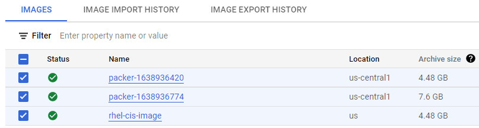
